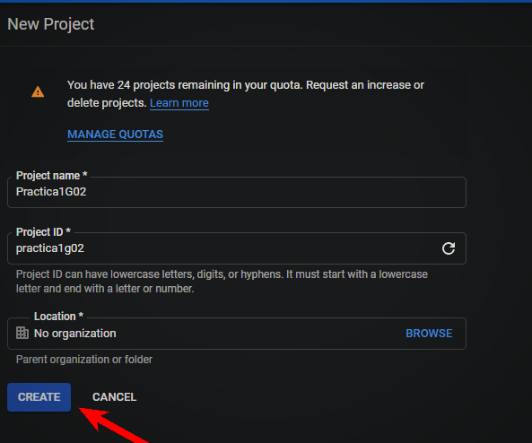
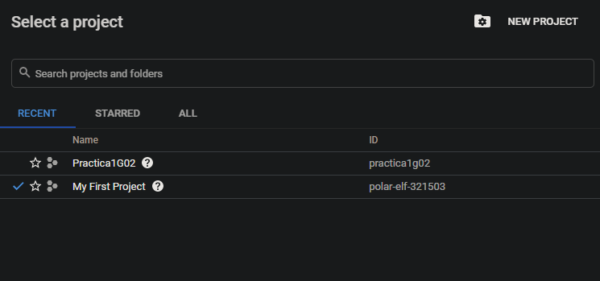
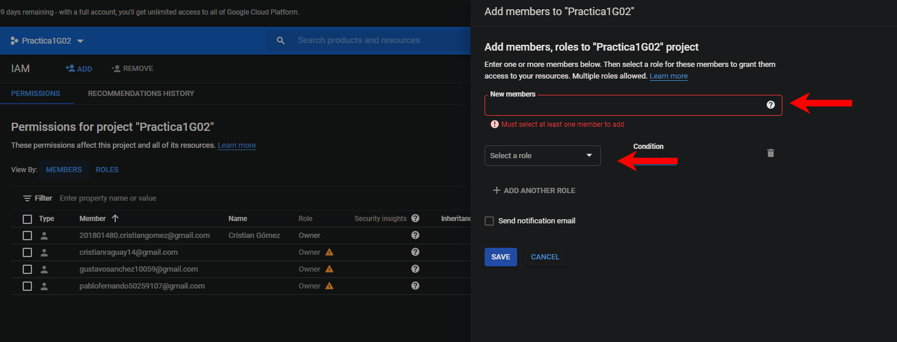

### Universidad de San Carlos de Guatemala
### Facultad de Ingeniería
### Escuela de Ciencias y Sistemas

## Practica 1

 

    <table>
        <tr>
            <th>Nombre</th>
            <th>Carnet</th>
        </tr>
        <tr>
            <th>Cristian Daniel Raguay Vicente</th>
            <th>201603103</th>
        </tr>
        <tr>
            <th>Elmer Gustavo Sánchez García</th>
            <th>201801351</th>
        </tr>
        <tr>
            <th>Cristian Alexander Gomez Guzman</th>
            <th>201801480</th>
        </tr>
        <tr>
            <th>Pablo Fernando Cabrera Pineda</th>
            <th>2019</th>
        </tr>
    </table>

 

### Crear 
#### Creamos nuestro proyecto 

    

        
         
         
        
    

## Crear 
#### Creamos nuestro proyecto 

    

        
    

