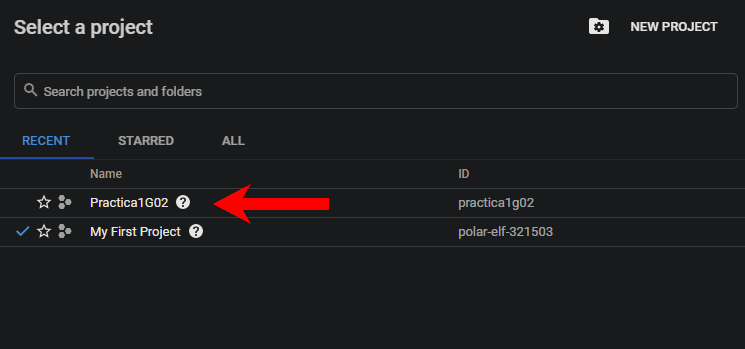
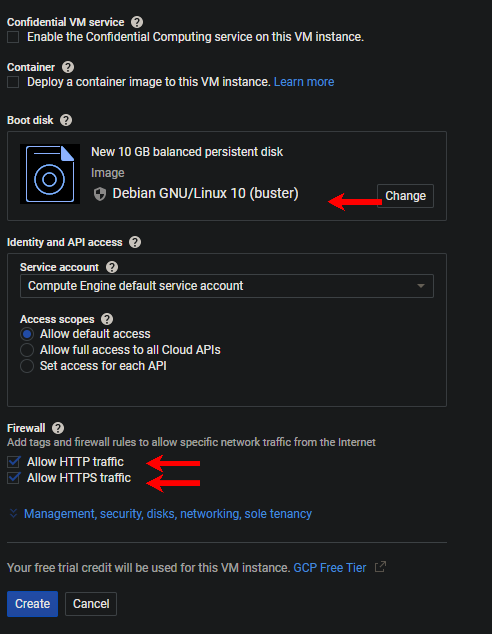
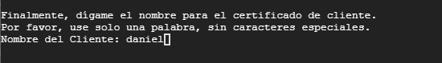
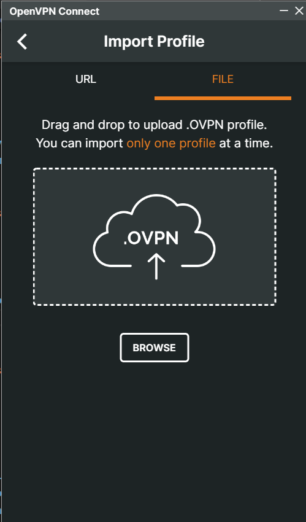
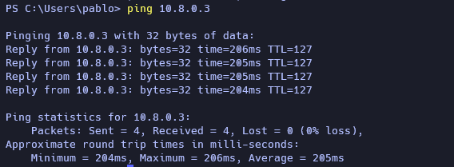
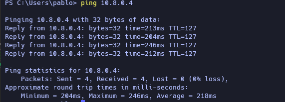
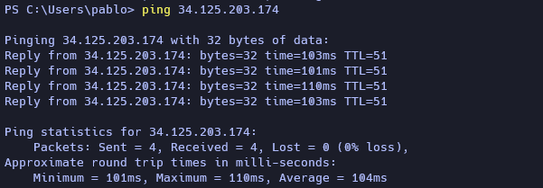

### Universidad de San Carlos de Guatemala

### Facultad de Ingeniería

### Escuela de Ciencias y Sistemas

## Practica 1


<div>
    <p align="center">
        
  <p>
</div>

<hr>
<br>
<div>
    <table>
        <tr>
            <th>Nombre</th>
            <th>Carnet</th>
        </tr>
        <tr>
            <th>Cristian Daniel Raguay Vicente</th>
            <th>201603103</th>
        </tr>
        <tr>
            <th>Elmer Gustavo Sánchez García</th>
            <th>201801351</th>
        </tr>
        <tr>
            <th>Cristian Alexander Gomez Guzman</th>
            <th>201801480</th>
        </tr>
        <tr>
            <th>Pablo Fernando Cabrera Pineda</th>
            <th>201901698</th>
        </tr>
    </table>
</div>
<br>
<hr>

## Plataforma utilizada

<div>
    <p align="center">
        
    <p>
</div>

## Software utlizado

<div>
    <p align="center">
        
    <p>
</div>

## Nuevo proyecto

### Creamos nuestro proyecto, ingresamos el nombre y si deseamos podemos modificar el ID.

<div>
    <p align="center">
        
    <p>
</div>

### Seleccionamos el proyecto creado.

<div>
    <p align="center">
     
    <p>
</div>

## IAM y ADMIN
### Agregamos y seleccionamos el rol que tendran nuestros compañeros de equipo en este caso se les otorgo el acceso completo.

<div>
    <p align="center">
        
    <p>
</div>

## Compute Engine
### Seleccionamos VM Instances.
<div>
    <p align="center">
        
    <p>
</div>

## Creamos una nueva instancia

<div>
    <p align="center">
        
    <p>
</div>

### Ingresamos un nombre y seleccionamos el tipo de maquina que deseamos.

<div>
    <p align="center">
        
    <p>
</div>

### podemos elegir el sistemas operativo, en este caso se utilizara Debian y seleccionamos en el apartado de Firewall el acceso por HTTP y HTTPS.

<div>
    <p align="center">
         
    <p>
</div>

## Instancia VM

### Después de seguir los pasos anteriores se puede observar que se creó satisfactoriamente la máquina virtual (VM). Se tiene que revisar que este la IP interna y la IP externa aparezcan en la instancia de la maquina virtual. Se presiona el boton de SSH para que se pueda proceder con el pasos siguientes.

```console
    Internal IP: 10.128.0.2
    External IP: 34.125.203.174
```

<div>
    <p align="center">
        
    </p>
</div>

## Cliente SSH

### Esta venta ventana emergente es un cliente SSH de Google que sirve para manejar la máquina virtual. Luego se procede a escribir el comando para poder actualizar los repositorios del sistema operativo (Debian) este proceso tarda unos minutos dependiendo de las especificaciones de la máquina virtual.

```console
    ~$: sudo apt-get update
```

<div>
    <p align="center">
        
    </p>
</div>

## Instalar WGET

### Luego de actualizar los repositorios, se procede a instalar el comando de **wget**. La funcionalidad de **wget** es que permita la descarga de contenido desde servidores web de una forma simple.

```console
    ~$: sudo apt-get install wget
```

<div>
    <p align="center">
        
    </p>
</div>

## Comando WGET

### Ahora que se tiene instalado wget, se procede con el comando más **importante**, lo que hace es descargar un archivo con extension _.sh_ de la página [cubaelectronica](www.cubaelectronica.com) y despues ejecuta el archivo descargado.

```console
    ~$: sudo wget https://cubaelectronica.com/OpenVPN/openvpn-install.sh
    ~$: sudo bash openvpn-install.sh
```

<div>
    <p align="center">
        
    </p>
</div>

## Manejador Openvpn

### En esta parte del consola se le pide ingresa la dirección IP interna, pero el openvpn ya la pone por defecto entonces es de verificar que sea la misma.

```console
    IP address: 10.182.0.2
```

<div>
    <p align="center">
        
    </p>
</div>

## IP Pública

### En esta parte se solicita que ingrese la dirección publica que es la que va salir hacia internet, entonces se revisa en la instancia VM, se copia la IP externa y se coloca en la consola.

```console
    Direccion IP Pública / o hostaname: 34.125.203.174
```

<div>
    <p align="center">
        
    </p>
</div>

## Protocolo

### Se pregunta que protocolo desea utilizar, lo más recomendado es utilizar el protocolo **UDP**. Es un protocolo de la capa de transporte encargado del intercambio de datagramas.

```console
    Protocolo [1-2]: 1
```

<div>
    <p align="center">
        
    </p>
</div>

## Puerto

### Que puerto escuchará OpenVPN, se utiliza el que es por defecto para el protocolo UDP.

```console
    Puerto: 1194
```

<div>
    <p align="center">
        
    </p>
</div>

## DNS
### Para la configuración del DNS se dejó la configuración que viene por defecto que son los de Google para evitar problemas mas adelante.

```
   Opcion 3
```

<div>
    <p align="center">
        
    </p>
</div>

## Usuarios
### Para la creación de los usuarios debe ingresar una palabra sencilla sin números y caracteres especiales, esto es para evitar problemas al momento de que el programa cree el archivo de conexión.

<div>
    <p align="center">
        
    </p>
</div>

### Generamos el archivo de configuración, para la máquina cliente del usuario "daniel".
<div>
    <p align="center">
        
    </p>
</div>

### Se ingresa el archivo de configuracion en la aplicación de OpenVPN 
<div>
    <p align="center">
        
    </p>
</div>

### La conexion a la VPN deberia ser exitosa.
<div>
    <p align="center">
        
    </p>
</div>

### Probamos la conexion realizando un ping a la máquina de "daniel - 10.8.0.4".
<div>
    <p align="center">
        
    </p>
</div>

### NOTA: Si los paquetes no son recibidos verificar que el firewall de windows este desactivado.

## Firewall
### Lo siguiente a realizar es la configuración del Firewall, para esto nos vamos al menú de Google cloud seleccionamos la opción VPC networks, y buscamos la opción que dice Firewall.

<div>
    <p align="center">
        
    </p>
</div>

## Reglas
### Al selecciona la opción de firewall se muestra la siguiente pantalla en donde crearemos 2 reglas de firewall, que permita el trafico de entrada y salida, en la pantalla presionamos la opción Crear Regla de Firewall o Create Firewall Rule.

<div>
    <p align="center">
        
    </p>
</div>

## Regla de Entrada
### Para la creación de la regla de entrada agregaremos un nombre y una descripción, dejamos las demás opciones como están y nos vamos a la opción de destinos, cambiamos la configuración que tiene por la opción que dice todas las instancias de red, para permitir el trafico.

<div>
    <p align="center">
        
    </p>
</div>

## Rangos de IP
### En la opción de rangos de IP de origen se le va a ingresar los valores 0.0.0.0/0 para que permita el ingreso a toda IP, en la opción de Protocolos y puertos específicos seleccionamos la casilla que dice udp y le asignamos el valor de 1194 y presionamos el botón de crear.

<div>
    <p align="center">
        
    </p>
</div>

## Regla de Salida
### En esta regla lo que va a cambiar es la dirección de los datos, entonces nos ubicamos en la opción de Dirección del Trafico se seleccionamos la casilla de salida, y las memas opciones se configuraran igual que la regla anterior.

<div>
    <p align="center">
        
    </p>
</div>

## Ping entre Computadores en la VPN
Desde el computador con IP 10.8.0.5 se hace ping en la terminal hacia todos los demás computadores en la VPN, incluyendo el servidor.

### 10.8.0.2
<div>
    <p align="center">
        
    </p>
</div>

### 10.8.0.3
<div>
    <p align="center">
        
    </p>
</div>

### 10.8.0.4
<div>
    <p align="center">
        
    </p>
</div>

### 34.125.203.174 (servidor)
<div>
    <p align="center">
        
    </p>
</div>
