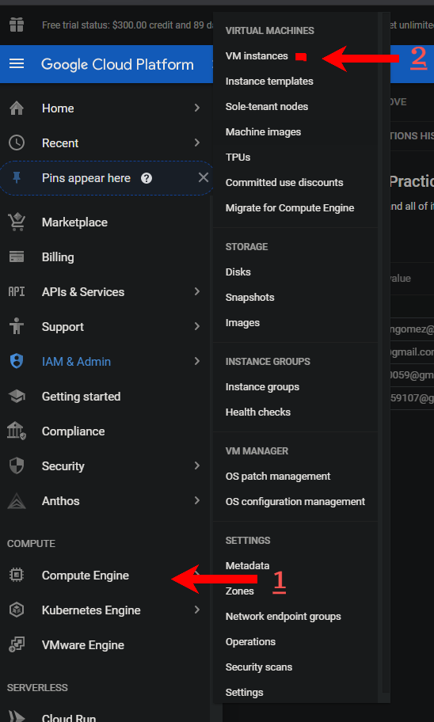

### Universidad de San Carlos de Guatemala
### Facultad de Ingeniería
### Escuela de Ciencias y Sistemas

<h2>Práctica 1</h2>

 

    

        <table>
            <tr>
                <th>Nombre</th>
                <th>Carnet</th>
            </tr>
            <tr>
                <th>Cristian Daniel Raguay Vicente</th>
                <th>201603103</th>
            </tr>
            <tr>
                <th>Elmer Gustavo Sánchez García</th>
                <th>201801351</th>
            </tr>
            <tr>
                <th>Cristian Alexander Gomez Guzman</th>
                <th>201801480</th>
            </tr>
            <tr>
                <th>Pablo Fernando Cabrera Pineda</th>
                <th>2019</th>
            </tr>
        </table>
    

 

### New Project
#### Creamos nuestro proyecto 

    

        
         
         
        
    

### IAM y ADMIN
#### Agregamos y seleccionamos el rol que tendran nuestros compañeros de equipo

    

        
    

### Compute Engine
#### Seleccionamos el aparatado VM Instances 

    

        
    

    

        
    

    

        
    

    

        
    

