### Universidad de San Carlos de Guatemala

### Facultad de Ingeniería

### Escuela de Ciencias y Sistemas

## Practica 2


<div>
    <p align="center">
        
  <p>
</div>

<hr>
<br>
<div>
    <table>
        <tr>
            <th>Nombre</th>
            <th>Carnet</th>
        </tr>
        <tr>
            <th>Cristian Daniel Raguay Vicente</th>
            <th>201603103</th>
        </tr>
        <tr>
            <th>Elmer Gustavo Sánchez García</th>
            <th>201801351</th>
        </tr>
        <tr>
            <th>Cristian Alexander Gomez Guzman</th>
            <th>201801480</th>
        </tr>
        <tr>
            <th>Pablo Fernando Cabrera Pineda</th>
            <th>201901698</th>
        </tr>
    </table>
</div>
<br>
<hr>

## Plataforma utilizada

<div>
    <p align="center">
        
    <p>
</div>

## Software utlizado

## OpenVPN v3.3.1
<div>
    <p align="center">
        
    <p>
</div>

## GNS3 v2.2.22  
<div>
    <p align="center">
     
    <p>
</div>

## VirtualBox v6.1 
<div>
    <p align="center">
     
    <p>
</div>

# Configuración de máquina virtual 
## En la barra de herramientas seleccionamos 'Edit' luego Preferencias
<div>
    <p align="center">
    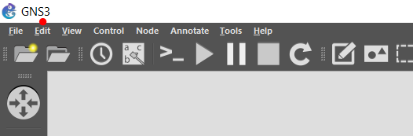 
    <p>
</div>

## Descargamos la máquina virtual de GNS3
<div>
    <p align="center">
    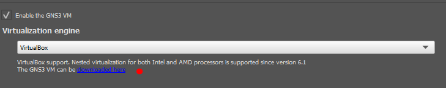 
    <p>
</div>

## Damos doble click sobre el archivo descargado 
<div>
    <p align="center">
     
    <p>
</div>

## Se nos desplegará un menú de nuestro virtualizador en este caso Virtual Box para importar la máquina virtual. El cual solo se debe de dar click en importar y listo la máquina virtual se agregará.
<div>
    <p align="center">
    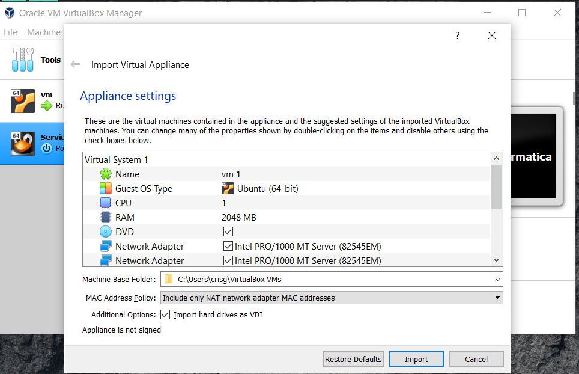 
    <p>
</div>


## En preferencias seleccionamos nuestro virtualizador en este caso se utilizo VirtualBox 

- Seleccionamos Enable the GNS3 VM 
- Seleccionamos nuestra maquina 
- Dejamos el puerto 80 por defecto
- Ingresamos la cantidad de vCPUs  
- Ingresamos la cantidad de RAM 
- Seleccionamoes Keep the GNS3 VM runnig, esto si queremos que nuestra máquina se encienda cada vez que abramos GNS3

<div>
    <p align="center">
    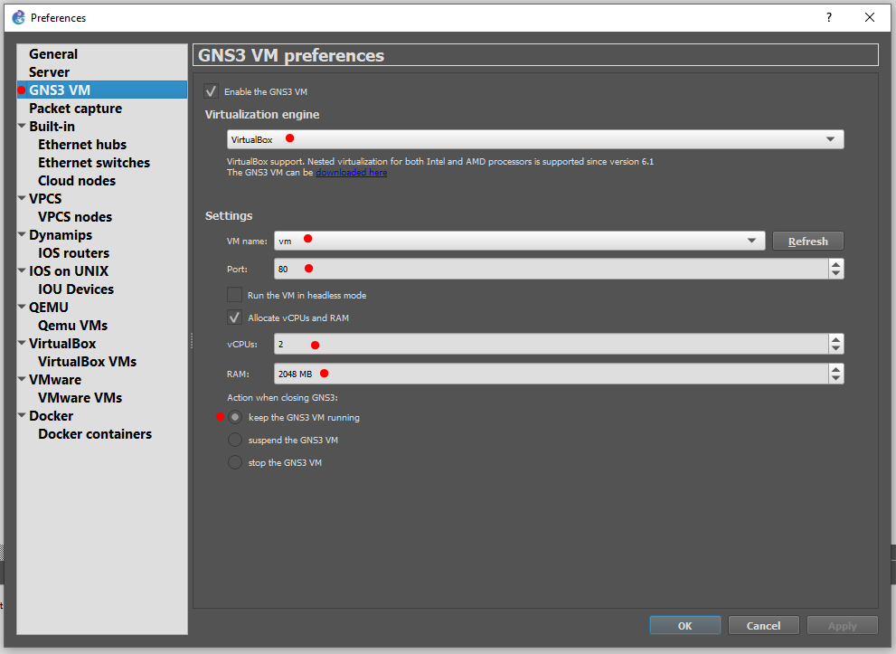 
    <p>
</div>

- damos OK.

## Automaticamente nuestra máquina "vm" se iniciara.
<div>
    <p align="center">
    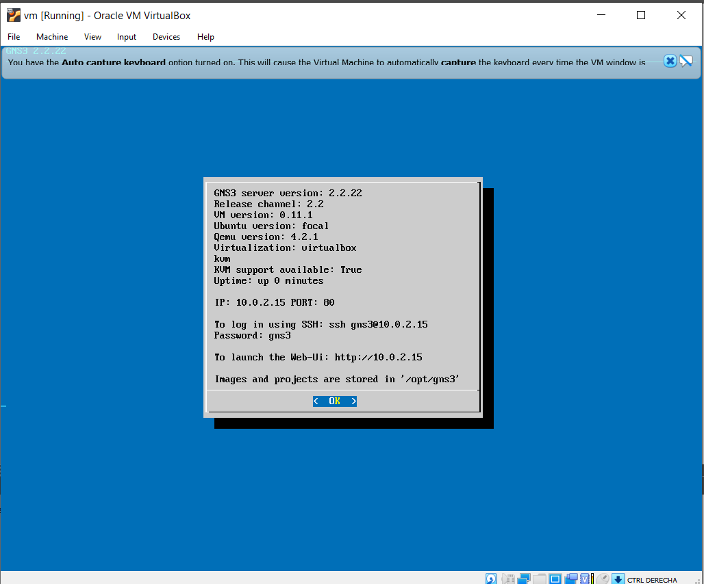 
    <p>
</div>

## Agregando una máquina virtual 
## En preferencias seleccionamos VirtualBox VMs 
- creamos una nueva

<div>
    <p align="center">
    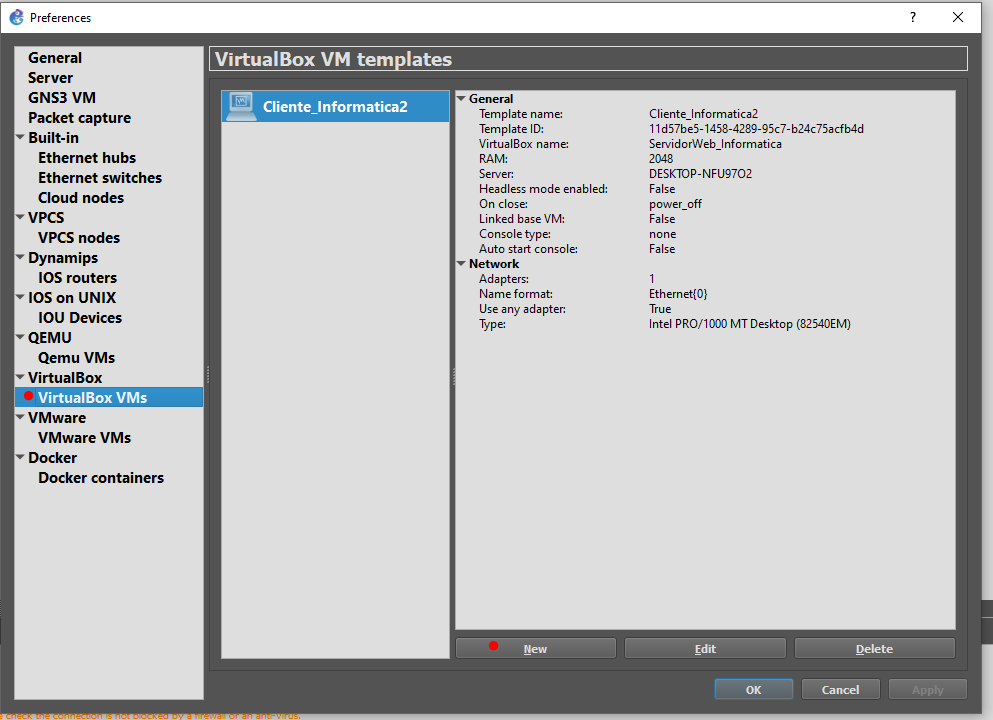 
    <p>
</div>

- Damos siguiente

<div>
    <p align="center">
    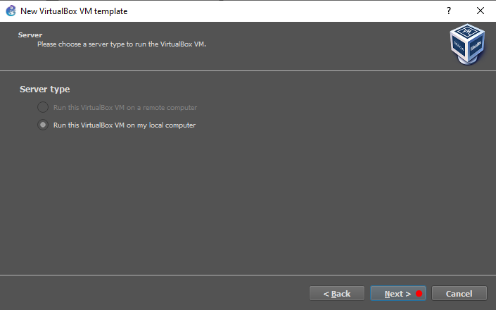 
    <p>
</div>

- Seleccionamos la máquina virtual que deseamos agregar

- Seleccionamos Use as linked base VM
<div>
    <p align="center">
    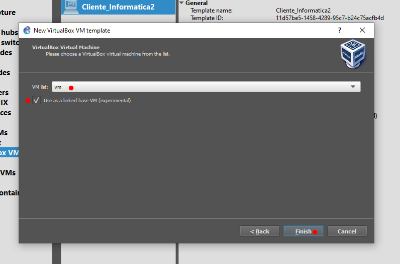 
    <p>
</div>

- Y listo la máquina se encontrará disponible en: Browse end device (Dispositivos).


#  Configuración de las topologías 
## Topologia 1
- Las conexiones entre las Nubes y los switchs son enlaces truncales 

<div>
    <p align="center">
    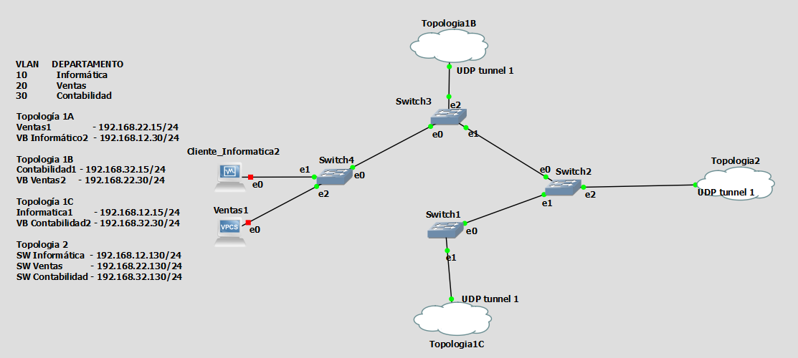 
    <p>
</div>


## Topología 1
## Topologia 2
### Se cinfiguro las VLAN del switch para cada uno de los servidores la 10 para informatica en el puerto 0, la 20 para el area de Ventas en el puerto 1 y la 30 para el area de Contabilidad.
<div>
    <p align="center">
    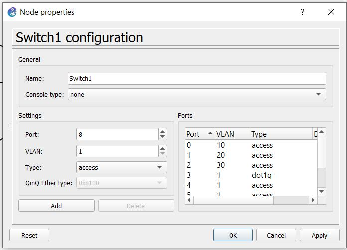 
    <p>
</div>

### Se configuro una conexion UDP para tener conexion con la topologia 1

<div>
    <p align="center">
    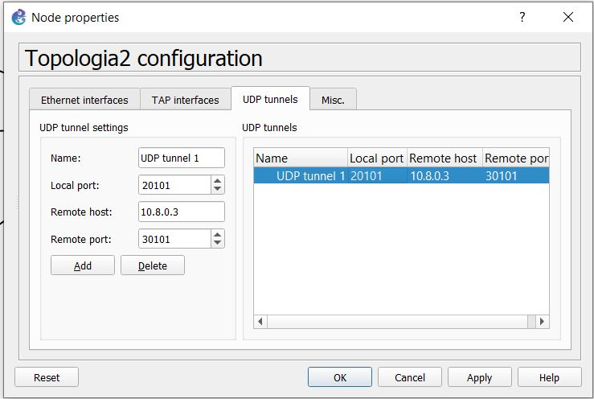 
    <p>
</div>

### Topologia 2 Completa
<div>
    <p align="center">
    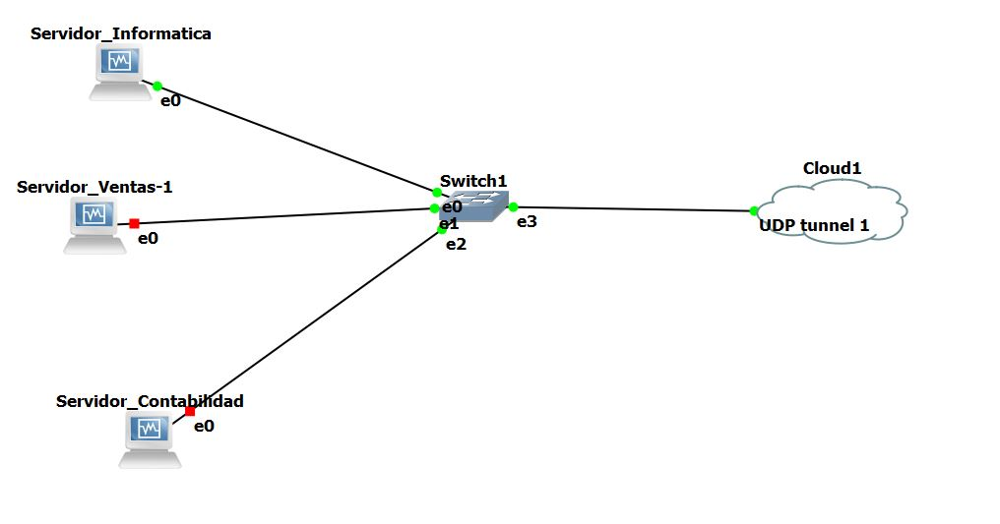 
    <p>
</div>

## Configuracíon VPCS

Para la configuración de las Virtual PC de GNS3, se tiene que ingresar a la consola de esta. Para encontrar la terminal le tiene que dar click derecho sobre la VPCS e ir a apartado de console. Ya ahí se de ingresar el comando para poder configurar la VPCS.

```console
    PC1> ip 192.168.12.15 255.255.255.0 192.168.12.1
    PC1> save
```

<div>
    <p align="center">
    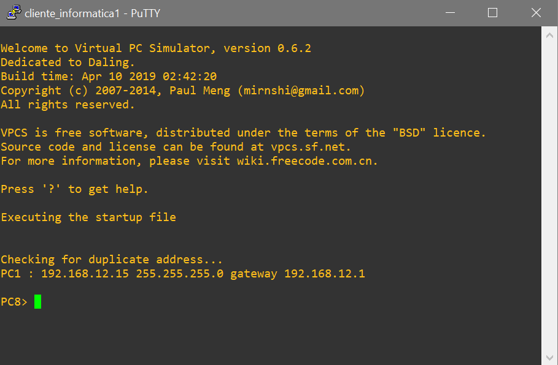 
    <p>
</div>

## Configuracíon de la maquina virtual

Esta configuración se debe hacer desde de la maquina virtual con sistema operativo Linux para este ejemplo se utilizó Ubuntu, se configuro la dirección IP, mascara, MAC y el Gateway. Esto se hace con el fin de que exista comunicación con las demás maquinas dentro de la misma red.

```console
    IP:         192.168.32.30
    Mascara:    255.255.255.0
    Gateway:    192.168.32.1
```

<div>
    <p align="center">
    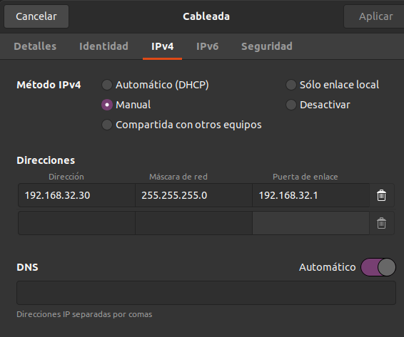 
    <p>
</div>

<div>
    <p align="center">
    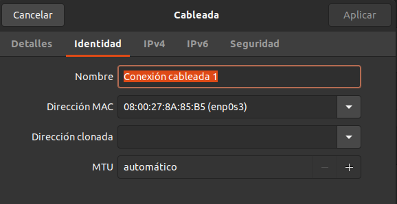 
    <p>
</div>

# Instalación y Configuración  de los servidores Web
### Lo primero que hay que hacer es actualisar el sistema operativo Linux con el comando.
```
sudo apt update
```

### Despues de Actualizar el sistema Linux se intala el Servidor Web Apache con el comando.
```
sudo apt install apache2
```
### En el navegador Web se escribe localhost y desplegara una la siguiente pagína como prueba de que se instalo apache correctamente.

<div>
    <p align="center">
    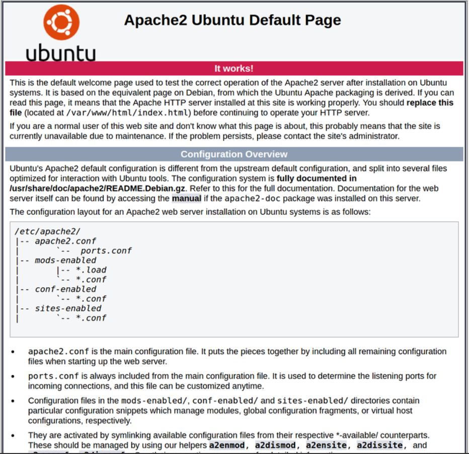 
    <p>
</div>

### Despues de intaloado apache no vamos a la carpera /var/www/html y ahi encontraremos un archivo html con nombre index.html que es la que trae por defecto apache, lo que vamos  a hacer es remplazar ese archivo con el que vamos a desplegar, este archivo tiene que tener el mismo nombre del archi eliminado para que se despliegue de manera correcta.
```
comando para eliminar
    sudo rm nombreArchivo
para crear un archivo
    sudo gedit index.html
para copiar un archivo ya listo para desplegar, debe de estar en la carpeta donde se encuentra el archivo a copiar
    cp nombreArchivo /direccion/destino
```

### Refrescamos el navegador de antes y veremos nuestra paguina desplegada

 <div>
    <p align="center">
    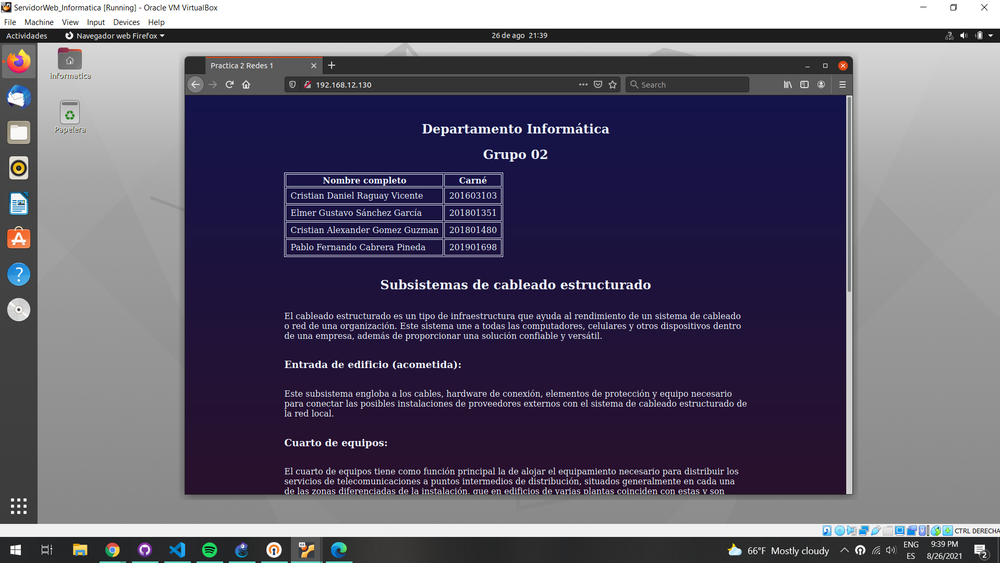 
    <p>
</div>

# Visualización de la página web desde el host vrtual Cliente

## Cliente informatica 2

<div>
    <p align="center">
     
    <p>
</div>

## Cliente contabilidad 2

<div>
    <p align="center">
    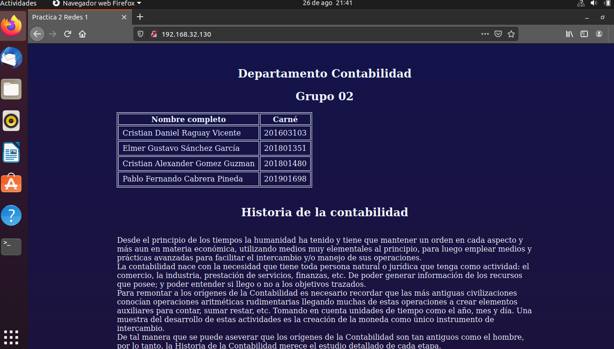 
    <p>
</div>

## Cliente ventas 2

<div>
    <p align="center">
    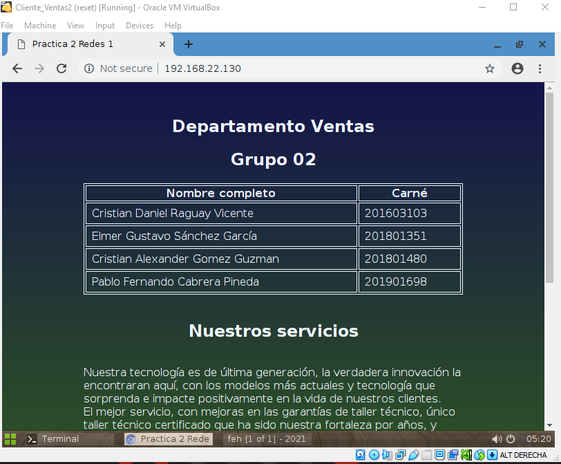 
    <p>
</div>

## Ping entre computadores
## Topología 1A
### Cliente de ventas (192.168.22.15) con cliente de ventas virtual
<div>
    <p align="center">
    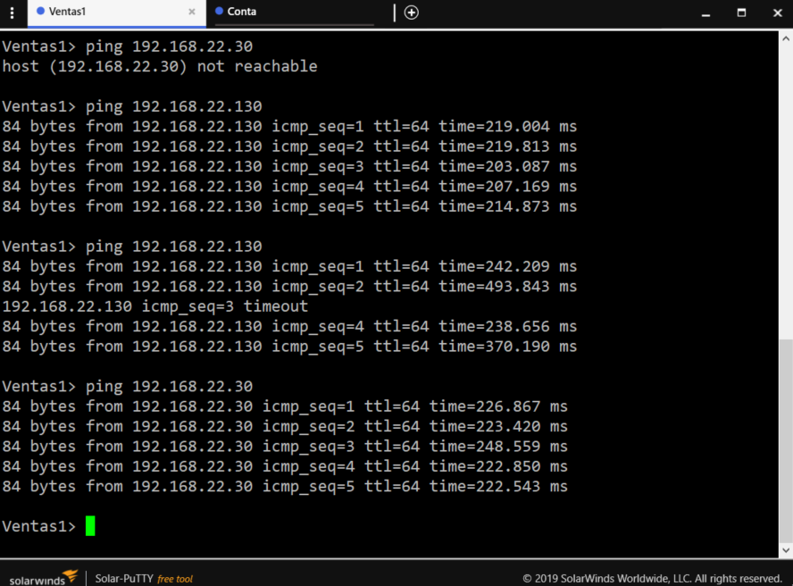 
    <p>
</div>

### Cliente de ventas (192.168.22.15) con servidor de ventas
<div>
    <p align="center">
    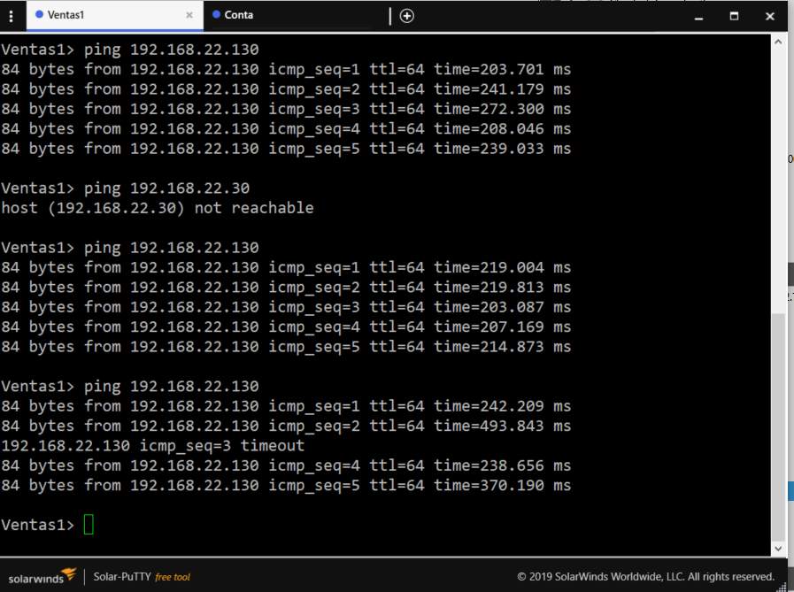 
    <p>
</div>

### Cliente virtual de informática (192.168.12.30) con cliente de informática
<div>
    <p align="center">
    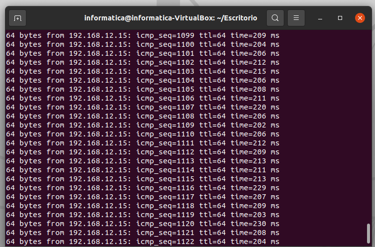 
    <p>
</div>

### Cliente virtual de informática (192.168.12.30) con servidor de informática
<div>
    <p align="center">
    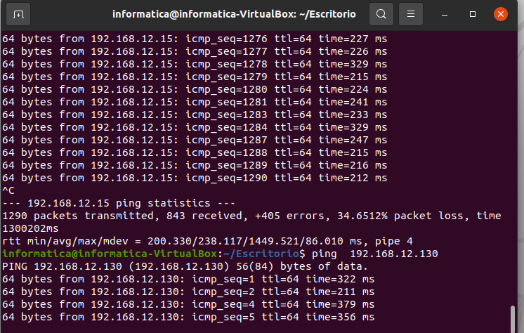 
    <p>
</div>

## Topología 1B
### Cliente de contabilidad (192.168.32.15) con cliente de contabilidad virtual
<div>
    <p align="center">
    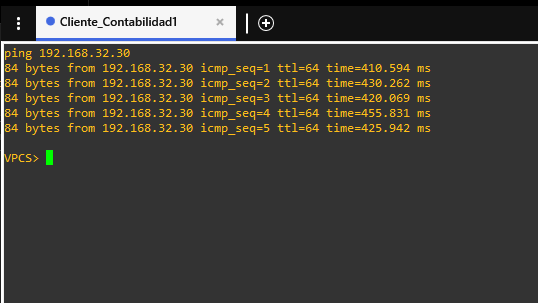 
    <p>
</div>

### Cliente de contabilidad (192.168.32.15) con servidor de contabilidad
<div>
    <p align="center">
    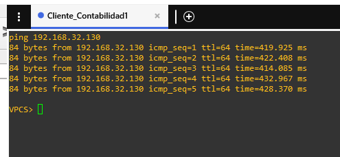 
    <p>
</div>

### Cliente virtual de ventas (192.168.22.30) con cliente de ventas
<div>
    <p align="center">
    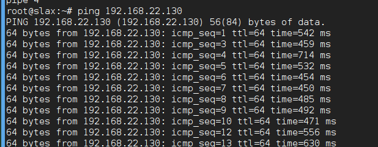 
    <p>
</div>

## Topología 1C
### Cliente de informática (192.168.12.15) con cliente de informática virtual
<div>
    <p align="center">
    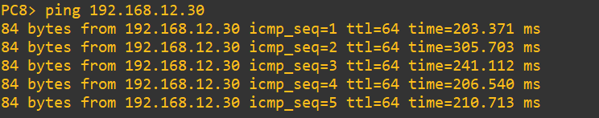 
    <p>
</div>

### Cliente de informática (192.168.12.15) con servidor de informática
<div>
    <p align="center">
    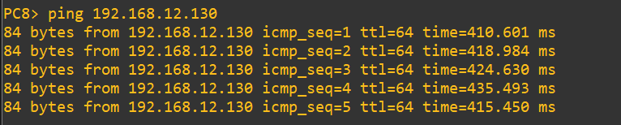 
    <p>
</div>

### Cliente virtual de contabilidad (192.168.32.30) con cliente de contabilidad
<div>
    <p align="center">
    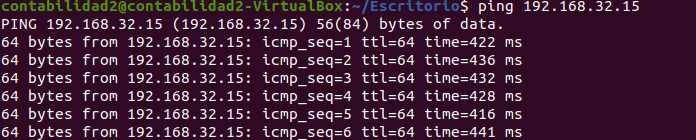 
    <p>
</div>

### Cliente virtual de contabilidad (192.168.32.30) con servidor de contabilidad
<div>
    <p align="center">
    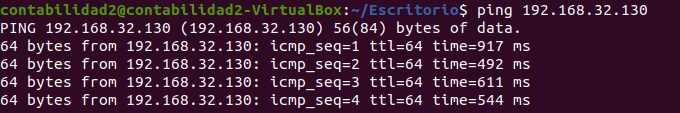 
    <p>
</div>

## Topología 2
#### Servidor de Informatica con los clientes que son las ip 192.168.12.15 y ip 192.168.12.30 
<div>
    <p align="center">
    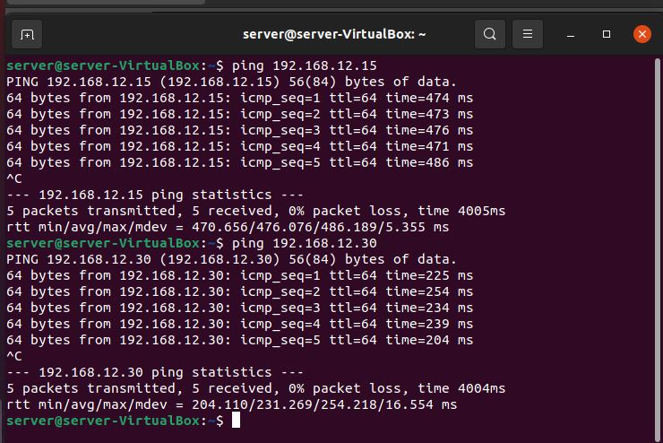 
    <p>
</div>

#### Servidor de Ventas con los clientes que son las ip 192.168.22.15 y ip 192.168.22.30
<div>
    <p align="center">
    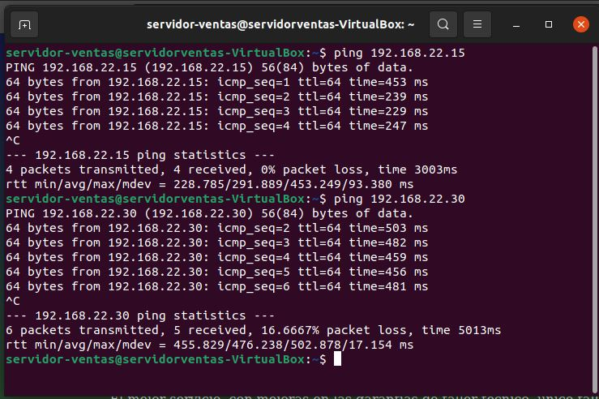 
    <p>
</div>

### Servidor de Contabilidad con los clientes que son las ip 192.168.32.15 y ip 192.168.32.30
<div>
    <p align="center">
    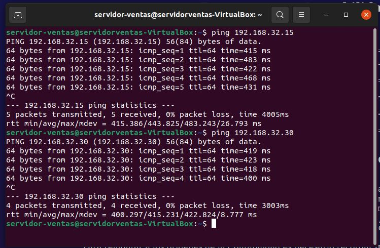 
    <p>
</div>
