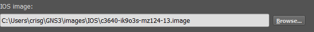
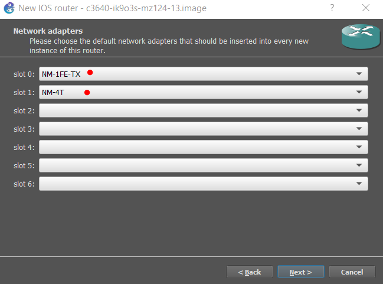

### Universidad de San Carlos de Guatemala

### Facultad de Ingeniería

### Escuela de Ciencias y Sistemas

## Práctica 3


<div>
    <p align="center">
        
  <p>
</div>

<hr>
<br>
<div>
    <table>
        <tr>
            <th>Nombre</th>
            <th>Carnet</th>
        </tr>
        <tr>
            <th>Cristian Daniel Raguay Vicente</th>
            <th>201603103</th>
        </tr>
        <tr>
            <th>Elmer Gustavo Sánchez García</th>
            <th>201801351</th>
        </tr>
        <tr>
            <th>Cristian Alexander Gomez Guzman</th>
            <th>201801480</th>
        </tr>
        <tr>
            <th>Pablo Fernando Cabrera Pineda</th>
            <th>201901698</th>
        </tr>
    </table>
</div>
<br>
<hr>


## **Índice**   
1. [Requerimientos](#id1)
2. [Carga de imagen de Router](#id2)
3. [Comandos utilizados](#id3)
4.  [Ping entre topologias](#id9)


<div id='id1' />

## Requerimientos 

### Software utilizado
* GNS3 v2.2.22 
* Open VPN

### Requerimientos minimos para usar GNS3
*   Procesador:  2 o mas núcleos lógicos
*   Virtualización:  Se requieren extensiones de virtualización. Es posible que deba habilitar esto a través del BIOS de su computadora.
*   4 GB RAM 
*   1 GB de espacio disponible

<div id='id2' />

## Carga de imagen de router
Imagen utilizada: [c3640-ik9o3s-mz124-13.bin](https://drive.google.com/drive/folders/1QMyVkM_RfSWhcxW5FSp1pjLopg15iyZO?usp=sharing)

### En la barra de navegación ingresamos a Edit > Preferences
### Seleccionamos IOS routers
<div>
    <p align="center">
        
    <p>
</div>

### Seleccionamos en new

<div>
    <p align="center">
        
    <p>
</div>

### selecionamos la tercera opción 
### damos click a next

<div>
    <p align="center">
        
    <p>
</div>

### Luego seleccionamos New Image e ingresamos la ruta de nuestra imagen
### damos click a next

<div>
    <p align="center">
        
    <p>
</div>

### Nos preguntará que si queremos descomprimir el .bin, Damos click en Yes
### damos click a next


<div>
    <p align="center">
        
    <p>
</div>

### damos click a next

<div>
    <p align="center">
        
    <p>
</div>

### damos click a next

<div>
    <p align="center">
        
    <p>
</div>

### damos click a next

<div>
    <p align="center">
        
    <p>
</div>

### Seleccionamos los adpatadores NM-1FE-TX y el NM-4T
### damos click a next

<div>
    <p align="center">
        
    <p>
</div>

### Damos click a Idle-PC fincder
### damos click a next
<div>
    <p align="center">
        
    <p>
</div>

### La imagen ha sido agregada.

<div>
    <p align="center">
        
    <p>
</div>


<div id='id3' />

## Comandos utilizados 

## Topología 2
### Configuración del port-channel en el switch 1
```
conf t
int range f1/1 - 3
channel-group 2 mode on
end
conf t
int range f1/4 - 6
channel-group 3 mode on
end
```

### Configuración del port-channel en el switch 2
```
conf t
int range f1/1 - 3
channel-group 1 mode on
end
conf t
int range f1/4 - 6
channel-group 2 mode on
end
```

### Configuración del port-channel en el switch 3
```
conf t
int range f1/1 - 3
channel-group 1 mode on
end
conf t
int range f1/4 - 6
channel-group 3 mode on
end
```


## Topología 3
### Configuración del port-channel en el switch 7
```
conf t
int range f1/0 - 2 channel-group 3 mode on
int range f1/3 - 5 channel-group 1 mode on
int port-channel 3 switchport mode trunk switchport trunk allowed vlan 1,1002-1005
int port-channel 1 switchport mode trunk switchport trunk allowed vlan 1,1002-1005
end
```

### Configuración del port-channel en el switch 8
```
conf t
int range f1/0 - 2 channel-group 2 mode on
int range f1/3 - 5 channel-group 1 mode on
int port-channel 2 switchport mode trunk switchport trunk allowed vlan 1,1002-1005
int port-channel 1 switchport mode trunk switchport trunk allowed vlan 1,1002-1005
end
```

### Configuración del port-channel en el switch 9
```
conf t
int range f1/0 - 2 channel-group 2 mode on
int range f1/3 - 5 channel-group 3 mode on
int port-channel 2 switchport mode trunk switchport trunk allowed vlan 1,1002-1005
int port-channel 3 switchport mode trunk switchport trunk allowed vlan 1,1002-1005
end
```

### Comprobando configuraciones de los switch
```
show etherchannel port-channel
show etherchannel summary
```

## Topología 4
### Comandos utilizados para configurar las interfaces del router a redes

```
    conf t
    int f0/0
    ip address 192.168.21.1 255.255.255.0
    no shutdown
    exit

```


### Configuración de interfaces entre routers

```
    conf t
    int s3/1
    ip address 172.23.0.1 255.255.0.0
    no shutdown
    exit
```

### Comandos utlizados para configurar las rutas estáticas

```
    conf t
    ip route 192.168.23.0 255.255.255.0 172.23.0.2
    exit

```
### Comprobando nuestras configuraciones

```
    sh ip int br # Muestra la configuración de las interfaces
    sh ip ro  # Muestra la tabla de ruteo

```

<div id='id9' />

# Pings entre topologias

## Topología 2
### VPC 7 a todas las VPC's y Router

<div>
    <p align="center">
        
    <p>
</div>


<div>
    <p align="center">
        
    <p>
</div>

### VPC 8 a todas las VPC's y al router

<div>
    <p align="center">
        
    <p>
</div>


<div>
    <p align="center">
        
    <p>
</div>

## Topología 3
### Desde PC3 hasta los router de capa 3 y las demás VPC


### Desde PC4 hasta los router de capa 3 y las demás VPC


