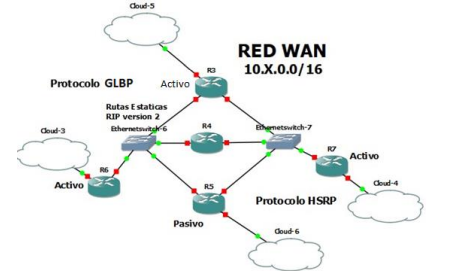
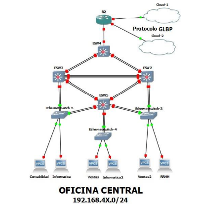
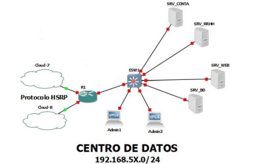

### Universidad de San Carlos de Guatemala

### Facultad de Ingeniería

### Escuela de Ciencias y Sistemas

## Manual Técnico


<div>
    <p align="center">
        
  <p>
</div>

<hr>
<br>
<div>
    <table>
        <tr>
            <th>Nombre</th>
            <th>Carnet</th>
        </tr>
        <tr>
            <th>Cristian Daniel Raguay Vicente</th>
            <th>201603103</th>
        </tr>
        <tr>
            <th>Elmer Gustavo Sánchez García</th>
            <th>201801351</th>
        </tr>
        <tr>
            <th>Cristian Alexander Gomez Guzman</th>
            <th>201801480</th>
        </tr>
        <tr>
            <th>Pablo Fernando Cabrera Pineda</th>
            <th>201901698</th>
        </tr>
    </table>
</div>
<br>
<hr>


## **Índice**   
1. [Requerimientos](#id1)
2. [Comandos utilizados](#id2)


<div id='id1' />

## Requerimientos 

### Software utilizado
* GNS3 v2.2.22 
* Open VPN

### Requerimientos minimos para usar GNS3
*   Procesador:  2 o mas núcleos lógicos
*   Virtualización:  Se requieren extensiones de virtualización. Es posible que deba habilitar esto a través del BIOS de su computadora.
*   4 GB RAM 
*   1 GB de espacio disponible


## Topologia 1: Red WAN


### Numero de hosts: 5
### Desglose
- Router: 5

### Red: 10.2.0.0/16
| Decimal | Binario   | Conversión |
| ------- | --------- | ---------- |
| 10      | 0000 1010 | 2+8 = 10   |
| 2       | 0000 0010 | 2 = 2      |
| 0       | 0000 0000 | 0 = 0      |
| 0       | 0000 0000 | 0 = 0      |

| Red               | Host              |
| ----------------- | ----------------- |
| 00001010 00000010 | 00000000 00000000 |

### Número de subredes
Se utilizarán 6 subredes, pues es el máximo de interfaces a usar en un solo router.

| Subred | Nombre |
| :----: | :----: |
|   1    |  Int1  |
|   2    |  Int2  |
|   3    |  Int3  |
|   4    |  Int3  |
|   5    |  Int3  |
|   6    |  Int3  |

### Cálculo de subnetting mediante VLSM
#### Subred 1
1. Identificar máscara actual: 11111111.11111111.00000000.00000000
2. Obtener número de host: 2^3 - 2 = 6 >= 6; m = 3
3. Obtener nueva máscara: 11111111.11111111.**11111111.11111**000 (/29)
4. Obtener salto de red: 256 - 248 = 8

#### Subred 2
1. Identificar máscara actual: 11111111.11111111.00000000.00000000
2. Obtener número de host: 2^3 - 2 = 6 >= 6; m = 3
3. Obtener nueva máscara: 11111111.11111111.**11111111.11111**000 (/29)
4. Obtener salto de red: 256 - 248 = 8

#### Subred 3
1. Identificar máscara actual: 11111111.11111111.00000000.00000000
2. Obtener número de host: 2^3 - 2 = 6 >= 6; m = 3
3. Obtener nueva máscara: 11111111.11111111.**11111111.11111**000 (/29)
4. Obtener salto de red: 256 - 248 = 8

#### Subred 4
1. Identificar máscara actual: 11111111.11111111.00000000.00000000
2. Obtener número de host: 2^3 - 2 = 6 >= 6; m = 3
3. Obtener nueva máscara: 11111111.11111111.**11111111.11111**000 (/29)
4. Obtener salto de red: 256 - 248 = 8

#### Subred 5
1. Identificar máscara actual: 11111111.11111111.00000000.00000000
2. Obtener número de host: 2^3 - 2 = 6 >= 6; m = 3
3. Obtener nueva máscara: 11111111.11111111.**11111111.11111**000 (/29)
4. Obtener salto de red: 256 - 248 = 8

#### Subred 6
1. Identificar máscara actual: 11111111.11111111.00000000.00000000
2. Obtener número de host: 2^3 - 2 = 6 >= 6; m = 3
3. Obtener nueva máscara: 11111111.11111111.**11111111.11111**000 (/29)
4. Obtener salto de red: 256 - 248 = 8

| Salto | Network   | Mask            | P.D asignable | U.D asignable | Broadcast | Host totales | Cantidad de host |
| :---: | --------- | --------------- | ------------- | ------------- | --------- | :----------: | :--------------: |
|   6   | 10.2.0.0  | 255.255.255.248 | 10.2.0.1      | 10.2.0.6      | 10.2.0.7  |      6       |        6         |
|   6   | 10.2.0.8  | 255.255.255.248 | 10.2.0.9      | 10.2.0.14     | 10.2.0.15 |      6       |        6         |
|   6   | 10.2.0.16 | 255.255.255.248 | 10.2.0.17     | 10.2.0.22     | 10.2.0.23 |      6       |        6         |
|   6   | 10.2.0.24 | 255.255.255.248 | 10.2.0.25     | 10.2.0.30     | 10.2.0.31 |      6       |        6         |
|   6   | 10.2.0.32 | 255.255.255.248 | 10.2.0.33     | 10.2.0.38     | 10.2.0.39 |      6       |        6         |
|   6   | 10.2.0.40 | 255.255.255.248 | 10.2.0.41     | 10.2.0.46     | 10.2.0.47 |      6       |        6         |

### Direcciones
| Dispositivo | Direccion IP | Prefijo IP |
| ----------- | ------------ | :--------: |
| R3 int1     | 10.2.0.1     |    /18     |
| R3 int2     | 10.2.64.1    |    /18     |
| R3 int3     | 10.2.128.1   |    /18     |
| R4 int1     | 10.2.0.2     |    /18     |
| R4 int2     | 10.2.64.2    |    /18     |
| R4 int3     | 10.2.128.2   |    /18     |
| R5 int1     | 10.2.0.3     |    /18     |
| R5 int2     | 10.2.64.3    |    /18     |
| R5 int3     | 10.2.128.3   |    /18     |
| R6 int1     | 10.2.0.4     |    /18     |
| R6 int2     | 10.2.64.4    |    /18     |
| R6 int3     | 10.2.128.4   |    /18     |
| R7 int1     | 10.2.0.5     |    /18     |
| R7 int2     | 10.2.64.5    |    /18     |
| R7 int3     | 10.2.128.5   |    /18     |

## Topologia 2: Oficina Central


### Numero de hosts: 190
### Desglose
- Router: 1
- Recursos humanos: 21
- Contabilidad: 8
- Ventas: 93 + 93*(32/100) = 123
- Informatica: 31 + 31*(18/100) = 37

### Red: 192.168.42.0/24
| Decimal | Binario   | Conversión     |
| ------- | --------- | -------------- |
| 192     | 1100 0000 | 128+64 = 192   |
| 168     | 1010 1000 | 128+32+8 = 168 |
| 42      | 0010 1010 | 32+8+2 = 42    |
| 0       | 0000 0000 | 0 = 0          |

| Red                        | Host     |
| -------------------------- | -------- |
| 11000000 10101000 00110100 | 00000000 |

### Número de subredes
Se utilizará una subred por departamento, por lo que se necesitarán 4 subredes.

| Subred | Vlan  |     Nombre      |
| :----: | :---: | :-------------: |
|   1    |   -   | administradores |
|   2    |  10   |    rhumanos     |
|   3    |  20   |  contabilidad   |
|   4    |  30   |     ventas      |
|   5    |  40   |   informatica   |

### Cálculo de subnetting mediante VLSM
#### Ventas
1. Identificar máscara actual: 11111111.11111111.11111111.00000000
2. Obtener número de host: 2^7 - 2 = 126 >= 123; m = 7
3. Obtener nueva máscara: 11111111.11111111.**11111111.1**0000000 (/25)
4. Obtener salto de red: 256 - 128 = 128

#### Informática
1. Identificar máscara actual: 11111111.11111111.11111111.00000000
2. Obtener número de host: 2^6 - 2 = 62 >= 37; m = 6
3. Obtener nueva máscara: 11111111.11111111.**11111111.11**000000 (/26)
4. Obtener salto de red: 256 - 64 = 192

#### Recursos humanos
1. Identificar máscara actual: 11111111.11111111.11111111.00000000
2. Obtener número de host: 2^5 - 2 = 30 >= 21; m = 5
3. Obtener nueva máscara: 11111111.11111111.**11111111.111**00000 (/27)
4. Obtener salto de red: 256 - 32 = 224

#### Contabilidad
1. Identificar máscara actual: 11111111.11111111.11111111.00000000
2. Obtener número de host: 2^4 - 2 = 14 >= 8; m = 4
3. Obtener nueva máscara: 11111111.11111111.**11111111.1111**0000 (/28)
4. Obtener salto de red: 256 - 16 = 240

| VLAN  | Salto | Network        | Mask            | P.D asignable  | U.D asignable  | Broadcast      | Host totales | Cantidad de host |
| :---: | :---: | -------------- | --------------- | -------------- | -------------- | -------------- | :----------: | :--------------: |
|  30   |  128  | 192.168.42.0   | 255.255.255.128 | 192.168.42.1   | 192.168.42.126 | 192.168.42.127 |     126      |       123        |
|  40   |  192  | 192.168.42.128 | 255.255.255.192 | 192.168.42.129 | 192.168.42.190 | 192.168.42.191 |      62      |        37        |
|  10   |  224  | 192.168.42.192 | 255.255.255.224 | 192.168.42.193 | 192.168.42.222 | 192.168.42.223 |      30      |        21        |
|  20   |  240  | 192.168.42.224 | 255.255.255.240 | 192.168.42.225 | 192.168.42.238 | 192.168.42.239 |      14      |        8         |

### Direcciones
| Dispositivo      | Direccion IP   | Prefijo IP |
| ---------------- | -------------- | :--------: |
| VPC ventas       | 192.168.42.2   |    /25     |
| VPC ventas2      | 192.168.42.3   |    /25     |
| VPC informatica  | 192.168.42.130 |    /26     |
| VPC informatica2 | 192.168.42.131 |    /26     |
| VPC rrhh         | 192.168.42.194 |    /27     |
| VPC contabilidad | 192.168.42.226 |    /28     |

## Topologia 3: Centro de Datos


## TOPOLOGIA 3 (Daniel)
### Numero de hosts: 7
### Desglose
- Router: 1
- Administradores: 2
- Servidores contabilidad: 1
- Servidores recursos humanos: 1
- Servidores web: 1
- Servidores bases de datos: 1

### Red: 192.168.52.0/24
| Decimal | Binario   | Conversión     |
| ------- | --------- | -------------- |
| 192     | 1100 0000 | 128+64 = 192   |
| 168     | 1010 1000 | 128+32+8 = 168 |
| 52      | 0011 0100 | 32+16+4 = 52   |
| 0       | 0000 0000 | 0 = 0          |

| Red                        | Host     |
| -------------------------- | -------- |
| 11000000 10101000 00110100 | 00000000 |

### Número de subredes
Se utilizará una subred por cada departamento, y una subred para los administradores, por lo que se necesitarán 5 subredes.

| Subred | Vlan  |     Nombre      |
| :----: | :---: | :-------------: |
|   1    |   -   | administradores |
|   2    |  10   |    rhumanos     |
|   3    |  20   |  contabilidad   |
|   4    |  30   |     ventas      |
|   5    |  40   |   informatica   |

### Cálculo de subnetting mediante FLSM
1. Identificar máscara actual: 11111111.11111111.11111111.00000000
2. Obtener número bits necesarios para los host: 2^3 = 8 >= 5; n = 3
3. Obtener nueva máscara: 11111111.11111111.11111111.**111**00000 (/27)
4. Obtener salto de red: 256-(126+64+32) = 256-224 = 32

| VLAN  | Salto | Network        | Mask            | P.D asignable  | U.D asignable  | Broadcast      | Host totales | Cantidad de host |
| :---: | :---: | -------------- | --------------- | -------------- | -------------- | -------------- | :----------: | :--------------: |
|   -   |  32   | 192.168.52.0   | 255.255.255.224 | 192.168.52.1   | 192.168.52.30  | 192.168.52.31  |      30      |        2         |
|  10   |  32   | 192.168.52.32  | 255.255.255.224 | 192.168.52.33  | 192.168.52.62  | 192.168.52.63  |      30      |        1         |
|  20   |  32   | 192.168.52.64  | 255.255.255.224 | 192.168.52.65  | 192.168.52.94  | 192.168.52.95  |      30      |        1         |
|  30   |  32   | 192.168.52.96  | 255.255.255.224 | 192.168.52.97  | 192.168.52.126 | 192.168.52.127 |      30      |        1         |
|  40   |  32   | 192.168.52.128 | 255.255.255.224 | 192.168.52.129 | 192.168.52.158 | 192.168.52.159 |      30      |        1         |

### Direcciones
| Dispositivo | Direccion IP   | Prefijo IP |
| ----------- | -------------- | :--------: |
| R1 f0/0     | 192.168.52.42  |    /29     |
| R1 f1/0     | 10.2.0.34      |    /29     |
| R1 f3/0     | 192.168.52.162 |    /27     |
| VPC admin1  | 192.168.52.4   |    /27     |
| VPC admin2  | 192.168.52.5   |    /27     |
| srv_rrhh    | 192.168.52.35  |    /27     |
| srv_conta   | 192.168.52.66  |    /27     |
| srv_web     | 192.168.52.99  |    /27     |
| srv_bd      | 192.168.52.130 |    /27     |

<br>
<br>

<div id='id2' />

## Comandos utilizados

## Topologia 1: Red WAN
cuerpo

## Topologia 2: Oficina Central

### Creación de VTP (ESW4)
```
conf t
vtp domain redes1gp2
vtp password redes1gp2
vtp mode server
exit
sh vtp status
```

### Creación de VLANS (ESW4)
```
conf t

vlan 10
name RHUMANOS

vlan 20
name CONTABILIDAD

vlan 30
name VENTAS

vlan 40
name INFORMATICA
exit

sh vlan-sw
```

### Configuración de VTP (ESW2, ESW3, ESW5)
```
conf t
vtp domain redes1gp2
vtp password redes1gp2
vtp mode client
exit
sh vtp status
```

### Configuración de interfaces truncales (ESW4)
```
conf t
int range f1/0 - 1
switchport mode trunk
switchport trunk allowed vlan 1,10,20,30,40,1002-1005

int range f1/3 - 4
switchport mode trunk
switchport trunk allowed vlan 1,10,20,30,40,1002-1005

int f1/6
switchport mode trunk
switchport trunk allowed vlan 1,10,20,30,40,1002-1005
exit

sh int tr
```

### Configuración de interfaces truncales (ESW2)
```
conf t
int range f1/0 - 1
switchport mode trunk
switchport trunk allowed vlan 1,10,20,30,40,1002-1005

int range f1/3 - 4
switchport mode trunk
switchport trunk allowed vlan 1,10,20,30,40,1002-1005

int range f1/8 - 10
switchport mode trunk
switchport trunk allowed vlan 1,10,20,30,40,1002-1005

int f1/6
switchport mode trunk
switchport trunk allowed vlan 1,10,20,30,40,1002-1005
exit

sh int tr
```

### Configuración de interfaces truncales (ESW3)
```
conf t
int range f1/0 - 1
switchport mode trunk
switchport trunk allowed vlan 1,10,20,30,40,1002-1005

int range f1/3 - 4
switchport mode trunk
switchport trunk allowed vlan 1,10,20,30,40,1002-1005

int range f1/8 - 10
switchport mode trunk
switchport trunk allowed vlan 1,10,20,30,40,1002-1005

int f1/6
switchport mode trunk
switchport trunk allowed vlan 1,10,20,30,40,1002-1005
exit

sh int tr
```

### Configuración de interfaces truncales (ESW5)
```
conf t
int range f1/0 - 1
switchport mode trunk
switchport trunk allowed vlan 1,10,20,30,40,1002-1005

int range f1/3 - 4
switchport mode trunk
switchport trunk allowed vlan 1,10,20,30,40,1002-1005

int f1/8
switchport mode trunk
switchport trunk allowed vlan 1,10,20,30,40,1002-1005

int f1/6
switchport mode trunk
switchport trunk allowed vlan 1,10,20,30,40,1002-1005

int f1/10
switchport mode trunk
switchport trunk allowed vlan 1,10,20,30,40,1002-1005
exit

sh int tr
```

### Configuración de EtherChannel (ESW4)
```
config t

int range f1/0 - 1
channel-group 1 mode on

int range f1/3 - 4
channel-group 2 mode on
exit

wr
```

### Configuración de EtherChannel (ESW3)
```
config t

int range f1/0 - 1
channel-group 1 mode on

int range f1/8 - 10
channel-group 5 mode on

int range f1/3 - 4
channel-group 4 mode on
exit

wr
```

### Configuración de EtherChannel (ESW2)
```
config t

int range f1/0 - 1
channel-group 2 mode on

int range f1/8 - 10
channel-group 5 mode on

int range f1/3 - 4
channel-group 3 mode on
exit

wr
```

### Configuración de EtherChannel (ESW5)
```
config t

int range f1/0 - 1
channel-group 4 mode on

int range f1/3 - 4
channel-group 3 mode on
exit

wr
```

### Configuración de Inter-VLAN / Router on a stick (R2)
```
config t
int f1/0
no shutdown

int f1/0.10
int f1/0.20
int f1/0.30
int f1/0.40
exit

int f1/0.10
encapsulation dot1Q 10
ip address 192.168.42.193 255.255.255.224
exit

int f1/0.20
encapsulation dot1Q 20
ip address 192.168.42.225 255.255.255.240
exit

int f1/0.30
encapsulation dot1Q 30
ip address 192.168.42.1 255.255.255.128
exit

18. int f1/0.40
19. encapsulation dot1Q 40
20. ip address 192.168.42.129 255.255.255.192
21. exit

sh ip int br
sh int f0/0.10
sh run
sh ip arp
```

### Configuración de RIP (R2)
```
config t
int f2/0 -> 103
ip address 10.2.0.18 255.255.255.248
no shutdown

int f3/0 -> 203
ip address 10.2.0.26 255.255.255.248
no shutdown

conf t
router rip
version 2
network 10.2.0.16
network 10.2.0.24
network 192.168.42.0
network 192.168.42.128
network 192.168.42.192
network 192.168.42.224
end

sh ip route
```

## Topologia 3: Centro de Datos

### Configuración de Router on a stick (R1)
```
conf t
int f3/0
no shutdown
int f3/0.10
int f3/0.20
int f3/0.30
int f3/0.40
int f3/0.50
end

sh ip int br
```

### Configuración de interfaces lógicas (R1)
```
conf t
int f3/0.10
encapsulation dot1Q 10
ip address 192.168.52.33 255.255.255.224
exit

int f3/0.20
encapsulation dot1Q 20
ip address 192.168.52.65 255.255.255.224
exit

int f3/0.30
encapsulation dot1Q 30
ip address 192.168.52.97 255.255.255.224
exit

int f3/0.40
encapsulation dot1Q 40
ip address 192.168.52.129 255.255.255.224
exit

int f3/0.50
encapsulation dot1Q 50
ip address 192.168.52.1 255.255.255.224
exit

int f3/0
ip address 192.168.52.162 255.255.255.224
exit

int f0/0
ip add 10.2.0.42 255.255.255.248
exit

int f1/0
ip add 10.2.0.34 255.255.255.248
exit
```

### Creación de VLAN (ESW1)
```
conf t
vlan 10
name rhumanos

vlan 20
name contabilidad

vlan 30
name ventas

vlan 40
name informatica

vlan 50
name admin
exit

wr
```

### Configuración de interfaces de acceso (ESW1)
```
conf t
int f1/1
switchport mode access
switch access vlan 20

int f1/2
switchport mode access
switch access vlan 10

int f1/3
switchport mode access
switch access vlan 30

int f1/4
switchport mode access
switch access vlan 40

int f1/5
switchport mode access
switch access vlan 50

int f1/6
switchport mode access
switch access vlan 50
exit

wr
```

### Configuración de interfaces truncales (ESW1)
```
conf t
int f1/7
switchport mode trunk
switchport trunk allowed vlan 1,10,20,30,40,50,1002-1005
exit

wr
```

### Configuración de RIP (R1)
```
router rip
version 2
network 10.2.0.32
network 10.2.0.40
network 192.168.52.0
network 192.168.52.32
network 192.168.52.64
network 192.168.52.96
network 192.168.52.128
end
```

<div id='id3' />
